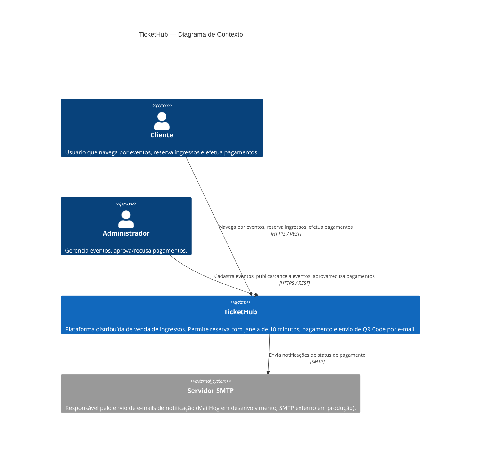
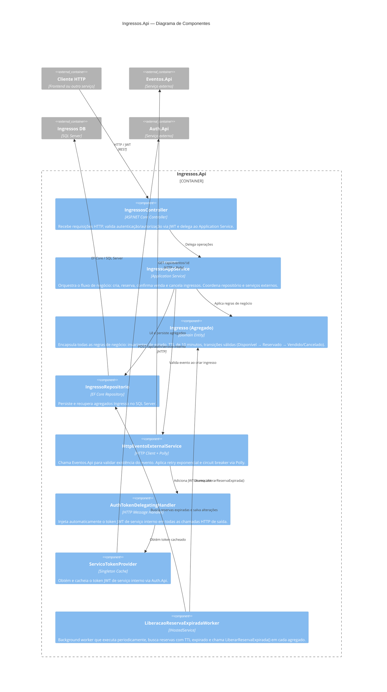
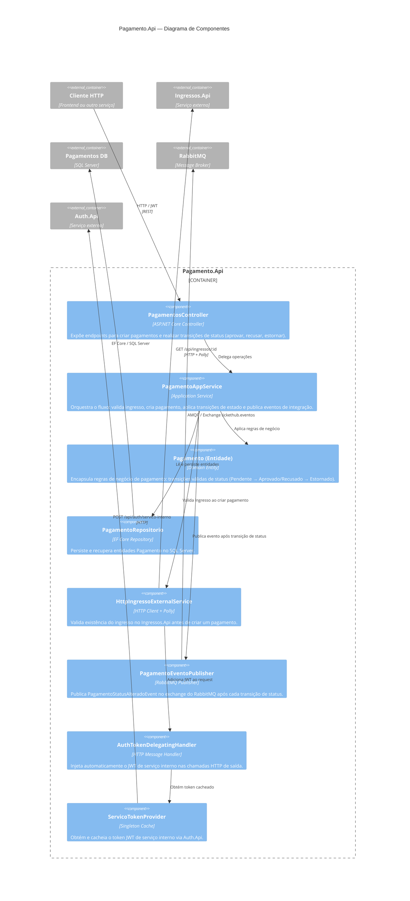

# TicketHub — Arquitetura C4

Documentação arquitetural em três níveis do modelo C4 (Context → Container → Component).

---

## Nível 1 — Context

Visão de alto nível: quem usa o sistema e com quais sistemas externos ele interage.

---

## Nível 2 — Container

Detalha os processos e bancos de dados que compõem o TicketHub.

```mermaid
C4Container
    title TicketHub — Diagrama de Containers

    Person(cliente, "Cliente")
    Person(admin, "Administrador")
    System_Ext(smtp, "SMTP")

    System_Boundary(tickethub, "TicketHub") {

        Container(auth_api, "Auth.Api", ".NET 10 / ASP.NET Core", "Autenticação e autorização. Emite JWT, gerencia refresh tokens e valida credenciais de serviços internos.")
        ContainerDb(auth_db, "Auth DB", "SQL Server", "Usuários e refresh tokens.")

        Container(eventos_api, "Eventos.Api", ".NET 10 / ASP.NET Core", "CRUD de eventos com máquina de estados (Rascunho → Publicado → Encerrado/Cancelado).")
        ContainerDb(eventos_db, "Eventos DB", "SQL Server", "Eventos e seus metadados.")

        Container(ingressos_api, "Ingressos.Api", ".NET 10 / ASP.NET Core", "Reserva e ciclo de vida de ingressos. Aplica TTL de 10 minutos via background worker.")
        ContainerDb(ingressos_db, "Ingressos DB", "SQL Server", "Ingressos e estado de reserva.")

        Container(pagamento_api, "Pagamento.Api", ".NET 10 / ASP.NET Core", "Processamento de pagamentos com resiliência via Polly. Publica eventos no RabbitMQ após aprovação/recusa.")
        ContainerDb(pagamento_db, "Pagamentos DB", "SQL Server", "Registros de pagamentos.")

        Container(notificacoes_worker, "Notificacoes.Worker", ".NET 10 / Worker Service", "Consome eventos do RabbitMQ e envia e-mail de notificação ao cliente.")

        ContainerDb(rabbitmq, "RabbitMQ", "RabbitMQ 3", "Message broker para eventos de integração assíncronos entre serviços.")
        ContainerDb(redis, "Redis", "Redis 7", "Cache distribuído. Disponível para rate limiting e cache de dados quentes.")
        ContainerDb(seq, "Seq", "Seq", "Agregador de logs estruturados. Recebe eventos Serilog de todos os serviços via HTTP.")
    }

    Rel(cliente, auth_api, "POST /api/auth/login, /refresh, /registrar", "HTTPS")
    Rel(admin, auth_api, "POST /api/auth/login", "HTTPS")

    Rel(cliente, eventos_api, "GET /api/eventos", "HTTPS / JWT")
    Rel(admin, eventos_api, "POST /api/eventos, /publicar, /cancelar, /encerrar", "HTTPS / JWT")

    Rel(cliente, ingressos_api, "GET, POST /api/ingressos, /reservar", "HTTPS / JWT")
    Rel(admin, ingressos_api, "POST /api/ingressos (criar), /confirmar-venda, /cancelar", "HTTPS / JWT")

    Rel(cliente, pagamento_api, "POST /api/pagamentos", "HTTPS / JWT")
    Rel(admin, pagamento_api, "POST /api/pagamentos/:id/aprovar, /recusar, /estornar", "HTTPS / JWT")

    Rel(auth_api, auth_db, "Lê/Escreve usuários e refresh tokens", "EF Core")
    Rel(eventos_api, eventos_db, "Lê/Escreve eventos", "EF Core")
    Rel(ingressos_api, ingressos_db, "Lê/Escreve ingressos", "EF Core")
    Rel(pagamento_api, pagamento_db, "Lê/Escreve pagamentos", "EF Core")

    Rel(ingressos_api, eventos_api, "Valida existência do evento ao criar ingresso", "HTTP / JWT Serviço Interno + Polly")
    Rel(pagamento_api, ingressos_api, "Valida existência do ingresso ao criar pagamento", "HTTP / JWT Serviço Interno + Polly")
    Rel(ingressos_api, auth_api, "Obtém token de serviço interno", "HTTP")
    Rel(pagamento_api, auth_api, "Obtém token de serviço interno", "HTTP")

    Rel(pagamento_api, rabbitmq, "Publica PagamentoStatusAlteradoEvent", "AMQP")
    Rel(notificacoes_worker, rabbitmq, "Consome PagamentoStatusAlteradoEvent", "AMQP")
    Rel(notificacoes_worker, smtp, "Envia e-mail de notificação", "SMTP")

    Rel(ingressos_api, redis, "Cache distribuído", "TCP")

    Rel(auth_api, seq, "Logs estruturados", "HTTP / Serilog")
    Rel(eventos_api, seq, "Logs estruturados", "HTTP / Serilog")
    Rel(ingressos_api, seq, "Logs estruturados", "HTTP / Serilog")
    Rel(pagamento_api, seq, "Logs estruturados", "HTTP / Serilog")
    Rel(notificacoes_worker, seq, "Logs estruturados", "HTTP / Serilog")
```

---

## Nível 3 — Component (Ingressos.Api)

Detalhamento interno do serviço mais complexo do sistema, que aplica DDD e concentra as regras de negócio de reserva.

---

## Nível 3 — Component (Pagamento.Api)

